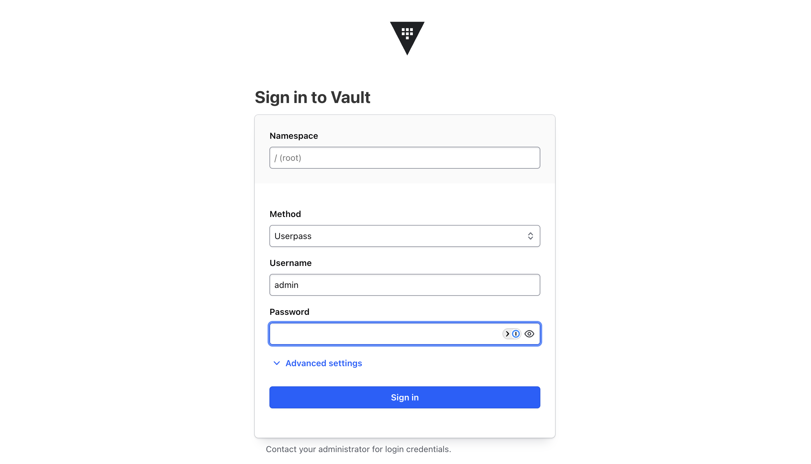

# Installing Vault Enterprise on OpenShift

- [Installing Vault Enterprise on OpenShift](#installing-vault-enterprise-on-openshift)
  - [Requirements](#requirements)
  - [Preparing and Deploying the Vault Helm Chart](#preparing-and-deploying-the-vault-helm-chart)
  - [Unsealing Vault](#unsealing-vault)
  - [Accessing the Vault UI](#accessing-the-vault-ui)
- [Setting up Vault Enterprise (Optional)](#setting-up-vault-enterprise-optional)
    - [Expose Vault publicly via a Route](#expose-vault-publicly-via-a-route)
    - [Set Up Simple User credentials for a Vault Admin user](#set-up-simple-user-credentials-for-a-vault-admin-user)

This is a step to step guide to deploy Vault Enterprise on an OpenShift cluster:


> * Vault Enterprise is deployed in HA mode across 3 pods using raft storage
> * All vault resources are contained in the vault-enterprise namespace

## Requirements

* The following CLI tools are required to follow this guide:

* [`helm`](https://helm.sh/docs/intro/install/)
* [`oc`](https://docs.redhat.com/en/documentation/openshift_container_platform/4.19/html/cli_tools/openshift-cli-oc). 
> This guide assumes the `oc` cli is logged in to the target Cluster and has `ClusterAdmin` privileges

* Vault Enterprise Licences are available to IBMers, [find more information here](https://ibm.biz/hc-pmo-tsr). Download it to your local machine

## Preparing and Deploying the Vault Helm Chart

* Download the Hashicorp Vault Helm chart:

```bash
helm repo add hashicorp https://helm.releases.hashicorp.com
```

* Update all local helm repositories:

```bash
helm repo update
```

* Create a namespace for vault enterprise:

```bash
oc new-project vault-enterprise
```

* Download the Vault Enterprise License from the link provided in the prerequisites. Save it as `vault-licence.hclic` file. Store it as an environment variable:
```bash
secret=$(cat <path-to-licence>/vault-licence.hclic) && \
echo $secret
```

* Store it as a secret in the cluster:

```bash
oc create secret generic vault-ent-license -n vault-enterprise --from-literal="license=${secret}"
```

* Save the following file as a `values.yaml` file:
```yaml
global:
  namespace: vault-enterprise
  openshift: true
server:
  dataStorage:
    storageClass: ocs-storagecluster-ceph-rbd
  image:
    repository: "hashicorp/vault-enterprise"
    tag: "1.20.0-ent"
  ha:
    enabled: true
    replicas: 3
    raft:
      enabled: true
  enterpriseLicense:
    secretName: vault-ent-license
```
> * review `server.dataStorage.storageClass` and ensure it is set to a block StorageClass available on your cluster
> * Review the image tag matches the version of Vault Enterprise, `1.20` is the latest version at the time of writing.


[Download values.yaml](./files/values.yaml){:download="values.yaml"}


* Once happy with the `values.yaml` file install the helm chart:

```bash
helm install vault-enterprise hashicorp/vault -f vault-enterprise/values.yaml 
```

<details><summary>Output</summary>

```bash
NAME: vault-enterprise
LAST DEPLOYED: Mon Jul 14 15:21:36 2025
NAMESPACE: vault-enterprise
STATUS: deployed
REVISION: 1
NOTES:
Thank you for installing HashiCorp Vault!

Now that you have deployed Vault, you should look over the docs on using
Vault with Kubernetes available here:

https://developer.hashicorp.com/vault/docs


Your release is named vault-enterprise. To learn more about the release, try:

  $ helm status vault-enterprise
  $ helm get manifest vault-enterprise
```
</details>

* Check Vault pods have deployed successfully:

```bash
oc get pods -n vault-enterprise
```

<details><summary>Output</summary>

```bash
NAME                                               READY   STATUS    RESTARTS   AGE
vault-enterprise-0                                 0/1     Running   0          2m
vault-enterprise-1                                 0/1     Running   0          2m
vault-enterprise-2                                 0/1     Running   0          2m
vault-enterprise-agent-injector-648bf45b79-n4lm2   1/1     Running   0          2m
```
</details>


Notice how the Vault pods are not ready. This is because Vault needs to be unsealed. 

## Unsealing Vault

Vault's raft storage elects one node (pod) as a leader, and all 3 pods as voters. In practice, only one pod (the leader) will be writing to vault, and the other 2 will be read only. 

* Initialize vault on the leader pod:

```bash
oc exec -n vault-enterprise vault-enterprise-0 -- vault operator init
```
<details><summary>Output</summary>

```bash
[output omitted for brevity]
Unseal Key 1: SzRXts...
Unseal Key 2: 9Y1frb...
Unseal Key 3: xAnzn1...
Unseal Key 4: dkn7nu...
Unseal Key 5: Ea6vf8...

Initial Root Token: hvs.uZ...

Vault initialized with 5 key shares and a key threshold of * Please securely
distribute the key shares printed above. When the Vault is re-sealed,
restarted, or stopped, you must supply at least 3 of these keys to unseal it
before it can start servicing requests.

Vault does not store the generated root key. Without at least 3 keys to
reconstruct the root key, Vault will remain permanently sealed!

It is possible to generate new unseal keys, provided you have a quorum of
existing unseal keys shares. See "vault operator rekey" for more information.
```
</details>

Note down these values as they are needed to unseal vault.

> One of the limitations of this install method is if any the vault pods are restarted, the need to be unsealed again.

* Repeat the following step 3 times, passing 3 different unseal keys to successfully unseal vault:

```bash
oc exec -it -n vault-enterprise vault-enterprise-0 -- vault operator unseal
```
* Enter the unseal key when prompted:

```bash
Unseal Key (will be hidden): 
```

* Once unsealed, run the following command:

```bash
oc exec -it -n vault-enterprise vault-enterprise-0 -- vault status  
```  

<details><summary>Output</summary>

```bash
Key                     Value
---                     -----
Seal Type               shamir
Initialized             true
Sealed                  false
Total Shares            5
Threshold               3
Version                 1.20.0+ent
Build Date              2025-06-23T11:04:16Z
Storage Type            raft
[output ommitted for brevity]
```
</details>

* The first vault pod is initialized and unsealed! You should now see its status as ready on OpenShift:

```bash
oc get pods -n vault-enterprise
```

```bash
NAME                                               READY   STATUS    RESTARTS   AGE
vault-enterprise-0                                 1/1     Running   0          5m
vault-enterprise-1                                 0/1     Running   0          5m
vault-enterprise-2                                 0/1     Running   0          5m
vault-enterprise-agent-injector-648bf45b79-n4lm2   1/1     Running   0          5m
```

---

* Unseal `vault-enterprise-1`. Start by joining it to the cluster:

```bash
oc exec -n vault-enterprise vault-enterprise-1 -- vault operator raft join http://vault-enterprise-0.vault-enterprise-internal:8200
```

* Repeat the following step 3 times, passing 3 different unseal keys to successfully unseal vault:

```bash
oc exec -it -n vault-enterprise vault-enterprise-1 -- vault operator unseal
```
* Enter the unseal key when prompted:

```bash
Unseal Key (will be hidden): 
```

* Once unsealed, run the following command:

```bash
oc exec -n vault-enterprise vault-enterprise-1 -- vault status  
```  

<details><summary>Output</summary>

```bash
Key                                    Value
---                                    -----
Seal Type                              shamir
Initialized                            true
Sealed                                 false
Total Shares                           5
Threshold                              3
Version                                1.20.0+ent
Build Date                             2025-06-23T11:04:16Z
Storage Type                           raft
Cluster Name                           vault-cluster-89d2dfbb
Cluster ID                             db583f94-0787-1efa-3c47-c2f6d76e1eef
Removed From Cluster                   false
HA Enabled                             true
HA Cluster                             https://vault-enterprise-0.vault-enterprise-internal:8201
HA Mode                                standby
Active Node Address                    http://10.130.1.5:8200
Performance Standby Node               true
[output omitted for brevity]
```
</details>

* The second vault pod is initialized and unsealed! You should now see its status as ready on OpenShift:

```bash
oc get pods -n vault-enterprise
```

```bash
NAME                                               READY   STATUS    RESTARTS   AGE
vault-enterprise-0                                 1/1     Running   0          7m
vault-enterprise-1                                 1/1     Running   0          7m
vault-enterprise-2                                 0/1     Running   0          7m
vault-enterprise-agent-injector-648bf45b79-n4lm2   1/1     Running   0          7m
```

---

* Unseal the third and final pod, `vault-enterprise-2`. Start by joining it to the cluster:

```bash
oc exec -n vault-enterprise vault-enterprise-2 -- vault operator raft join http://vault-enterprise-0.vault-enterprise-internal:8200
```

* Repeat the following step 3 times, passing 3 different unseal keys to successfully unseal vault:

```bash
oc exec -it -n vault-enterprise vault-enterprise-2 -- vault operator unseal
```
* You will be prompted to enter your unseal key:

```bash
Unseal Key (will be hidden): 
```

* Once unsealed, run the following command:

```bash
oc exec -n vault-enterprise vault-enterprise-2 -- vault status  
```  

<details><summary>Output</summary>

```bash
Key                                    Value
---                                    -----
Seal Type                              shamir
Initialized                            true
Sealed                                 false
Total Shares                           5
Threshold                              3
Version                                1.20.0+ent
Build Date                             2025-06-23T11:04:16Z
Storage Type                           raft
Cluster Name                           vault-cluster-89d2dfbb
Cluster ID                             db583f94-0787-1efa-3c47-c2f6d76e1eef
Removed From Cluster                   false
HA Enabled                             true
HA Cluster                             https://vault-enterprise-0.vault-enterprise-internal:8201
HA Mode                                standby
Active Node Address                    http://10.130.1.5:8200
[output omitted for brevity]
```
</details>

* The third vault pod is initialized and unsealed! You should now see its status as ready on OpenShift:

```bash
oc get pods -n vault-enterprise
```

```bash
NAME                                               READY   STATUS    RESTARTS   AGE
vault-enterprise-0                                 1/1     Running   0          10m
vault-enterprise-1                                 1/1     Running   0          10m
vault-enterprise-2                                 1/1     Running   0          10m
vault-enterprise-agent-injector-648bf45b79-n4lm2   1/1     Running   0          10m
```

## Accessing the Vault UI

* The vault system is now fully operational. You can access it from your local machine using the following command:

```bash
oc port-forward -n vault-enterprise svc/vault-enterprise 8200:8200
```

* Navigate to http://localhost:8200 to start using vault. 

The following steps are optional quality of life improvements for your vault deployment

---

# Setting up Vault Enterprise (Optional)

### Expose Vault publicly via a Route

* Run the following command to expose vault via a route:

```bash
oc create route edge vault-enterprise -n vault-enterprise --service=vault-enterprise --port=http
```

* Vault will be available at the following endpoint:

```bash
echo "https://$(oc get routes - vault-enterprise vault-enterprise -ojsonpath=\'{..host}\')"
```

### Set Up Simple User credentials for a Vault Admin user

Set up simple use password authentication for vault: 

* Start by enabling the `userpass` auth method:

```bash
oc exec -n vault-enterprise vault-enterprise-0 -- vault auth enable userpass
```

* Create a policy for your user. A very simple admin policy will look like below, although you will likely want to reduce permissions for your admin user:

```hcl
path "*" {
  capabilities = ["create", "read", "update", "delete", "list", "sudo"]
}
```
> This enables all capabilities for all paths to a user (i.e. superadmin)

[Download superadmin.hcl](./files/superadmin.hcl){:download="superadmin.hcl"}


* Save the policy as a file named `superadmin.hcl`. Copy it onto the vault pod:

```bash
oc cp $(pwd)/superadmin.hcl vault-enterprise/vault-enterprise-0:/vault/data/superadmin.hcl
```

* Upload the policy to vault:

```bash
oc exec -n vault-enterprise vault-enterprise-0 -- vault policy write superadmin /vault/data/superadmin.hcl
```

* Create an admin user:

```bash
oc exec -n vault-enterprise vault-enterprise-0 -- vault write auth/userpass/users/admin password="SuperSecurePassword" policies="superadmin"
```
* Log in as an admin user using the `Userpass` method:



---