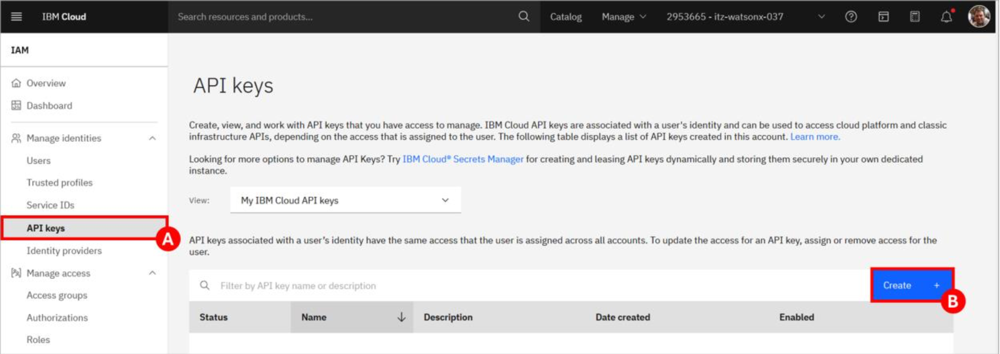

# App Development & Modernization with WCA

The main objective of this lab is to provide hands-on experience with some of the core features and capabilities available to developers in IBM watsonx Code Assistant (WCA). The lab content is loosely organized to align with the capabilities found in the two different plans
(editions) available for WCA:

**Essentials:** This accelerates software development, allowing developers to use WCA with integrated generative AI for coding tasks, including:

- Generating code
- Explaining code
- Creating unit tests
- Documenting code

**Standard:** In addition to all the capabilities found in the Essentials plan, the Standard plan also includes these enterprise Java modernization capabilities:

- Java upgrades, regardless of runtime
- WebSphere to Liberty transformation
- Enhanced test generation and code explanation

After completing this lab, you will have a deeper understanding of what is possible with WCA and will have observed how it can be a powerful tool to help accelerate software development and application modernization.

## Prerequisite Installation Steps

As previously mentioned, there are two separate components that make up IBM watsonx Code Assistant (WCA):

- WCA service – This is the back-end software, leveraging generative AI, that services requests from developers. It is available as software-as-a-service (SaaS) on IBM Cloud and as deployable software for on-premises and cloud deployments.
- WCA extension (also referred to as a plug-in) – Installed in an integrated development environment (IDE) on a developer’s own system, this is how the developer interacts with WCA. It includes a chat interface as well as in-source options for generating, explaining, and documenting code. It can also help drive Java upgrades and WebSphere to Liberty transformation, among other things. The IDEs currently supported by WCA are Visual Studio Code (VS Code) and Eclipse.

!!! Tip
    To avoid the need for you to setup your own development environment (which would include installation of an IDE, the WCA extension, various other software, and sample source code), a pre-configured environment has been made available for you in IBM Technology Zone (TechZone).  Likewise, a WCA service has been made available to you as well, also available through TechZone.  **However**, this lab assists you in setting up your own system to perform the lab on your own system using the TechZone WCA Service as the back-end.

### Reserve the TechZone Environment

!!! Warning "The prerequisite environment may already exist!"
    If you are performing this exercise as part of the bootcamp, the WCA environment may already exist.  Your IBM instructor will give you access to the API Key.  If this is the case you can [skip forward to workstation setup](./index.md/#workstation-setup)

Open the collection for [WCA-related environments in TechZone](https://techzone.ibm.com/collection/wca/environments){target=_blank}. Sign in with your IBMid if prompted.

Locate the Request **watsonX Code Assistant - Standard (GA) [Approval Gated]** tile and click the IBM Cloud environment / Reserve it button (A).   There are multiple tiles listed, some of which have a similar name – ensure you’re selecting the correct one.

{width=35%}

Accept the default for the reservation Name (A) or provide a name of your choosing. For the Purpose of the reservation, select Education (B).

{width=75%}

- Fill in the Purpose description box with the reason you are making the reservation. Then, select your Preferred Geography based on your desired location.
- Adjust the reservation’s Start date and time and End date and time as needed (note that you can extend your reservation later if you need more time).
- In the lower-right corner, follow the links to read TechZone’s terms, conditions, and security policies, and then select the checkbox to agree to them.
- Click Submit for approval.  
- A message in the upper-right corner will briefly appear stating that the reservation has been created.


!!! Note
    You will receive an email from IBM Technology Zone with a subject of “Request is Pending Approval”. Once it has been approved you will receive another email with a subject of “Request Approved”.
    
    When provisioning starts (based on the start time you provided) an email with a subject of “Reservation Provisioning on IBM Technology Zone” is sent. Finally, an email with a subject of “Reservation Ready on IBM Technology Zone” indicates that provisioning has completed.

While waiting for this reservation to be provisioned, continue on to the next section to request the second
environment you’ll need.

!!! Tip "If you want a developer system from TechZone..."
    If you chose not to use your local system as your development environment follow the below steps.

    The pre-configured development demonstration environment, which includes the following software and sample data:
    - Red Hat Enterprise Linux 9
    - Visual Studio Code (VS Code) (including the WCA extensions)
    - Eclipse IDE for Java Developers
    - OpenJDK 11 & 21
    - Sample ModResorts application
    
    Follow the steps below to provision your WCA development demonstration environment from TechZone.
    
    - Open the collection of [WCA-related environments in TechZone](https://techzone.ibm.com/collection/wca/environments){target="_blank"}. Sign in with your IBMid if prompted.
    - Locate the watsonx Code Assistant - Demonstration VM tile and click the IBM Cloud environment / Reserve it button.  Note: There are multiple tiles listed, some of which have a similar name – ensure you’re selecting the correct one.
    
    For the reservation type, select the Reserve now radio button.
    
    Accept the default for the reservation Name or provide a name of your choosing. For the Purpose of the reservation, select Education.
    
    Fill in the Purpose description box with the reason you are making the reservation. Then, select your Preferred Geography based on your desired location. 
    
    Adjust the reservation’s End date and time as needed (note that you can extend your reservation later if you need more time). Leave VPN Access as Disable.
    
    In the lower-right corner, follow the links to read TechZone’s terms, conditions, and security policies, and then select the checkbox to agree to them. Finally, click Submit.
    
    A message in the upper-right corner will briefly appear stating that the reservation has been created.  First, you will receive an email from IBM Technology Zone with a subject of “Reservation Provisioning on IBM Technology Zone”. Once it has been provisioned, an email with a subject of “Reservation Ready on IBM Technology Zone” is sent.


## Configure the TechZone WCA Service

There are three things that you will need to do before you can use the WCA service:

1. Join the IBM Cloud account. Your WCA service and other resources have been provisioned for you in this account.
2. Create an API key. This is how you will identify yourself and your WCA service within the WCA extension of your development environment.
3. Create a deployment space. This is the serving environment for WCA.

### Join the IBM Cloud Account

Once the environment has been provisioned, it is likely that would have received one additional email asking you to join an IBM Cloud account: “Action required: You are invited to join an account in IBM Cloud”.

The WCA instance you are being given access to is associated with one of many accounts that have been setup (they all have a name like itz-watsonx-###). You must join this account before you can use WCA.

!!! Info "Joining the Account Without Email"

    Access the TechZone reservation you have for "watsonX Code Assistant - Standard (GA) [Approval Gated]" and **Open your IBM Cloud Environment**.

    Check your notifications for the invitation that belongs to this recent reservation.

    {width=50%}

    Choose **Join Now**, accept the **Terms and Conditions** and **Join Account**.

    Finally, **Proceed** and switch to this new account within your IBM Cloud environment.

### Create an API Key

You must do the work in this section from the account mentioned in your reservation (which you joined and switched to in the previous section).  The API key you create here will be used later to configure the WCA VSCode extension from your development environment.

Open the Manage dropdown menu (A) and select Access (IAM) (B).


Select API keys (A) from the left-side menu. Then, click the Create button (B).



In the Create IBM Cloud API key pop-up window, enter WCA API key for the Name (A) and then click Create (B).

{width=50%}

**Copy** or **Download** the new API Key.  You will need this to sign into the VSCode extension you will configure later.

### Create a Deployment Space

From the TechZone account within IBM Cloud:

Click the Navigation Menu (A) in the upper-left corner of the page. Then select Resource list (B).

{width=25%}

This displays the list of services and resources that have been provisioned within the account – and that you have access to. Expand the AI / Machine Learning section (A). In here is your instance of IBM watsonx Code Assistant. Note the name; it will be in the form of
itzwca-**your unique identifier**. Click the name of your WCA instance (B).


Click the **Launch watsonx Code Assistant** button at the bottom of the page. If prompted, log in with your IBMid.

In the pop-up window, click the **Set up** button.

For the Type of installation, ensure that **Single user** is selected.

Scroll down to the Steps to complete section. Click the blue arrow icon (A) to the right of Create a deployment space.


In the Create a deployment space pop-up window, specify a Name (A) – for example, WCA deployment space. This is part of a global namespace, however, and has to be unique. So, if you’re told that what you specified is already in use, change the name to something unique.
    
Next, select your WCA service from the Code assistant service dropdown list (B). Only one service should be listed, and it should match the name of your service that you noted earlier.
    
Then, select your object storage instance from the Select storage service dropdown list (C). There will be many instances listed (belonging to others also using this account), so find the one that starts with `itzcos` and includes the identifier found in your WCA service name.
    
Finally, click the **Create** button.

After you are informed that the deployment space has been created, click the **X** in the upper-right corner of the pop-up window to close it.

The Create a deployment space step will now be marked as complete.

Click the blue arrow icon (A) to the right of Select your license preference for response generation.


This opens a new browser tab or window that allow you to configure how to display code suggestions. Review the information if you wish, but do not change anything. Simply close the browser tab to return to the page with the Steps to complete section.

Manually check the box for Select your license preference for response generations (A) to indicate that this step has been completed. Then, click the Go to home page button (B).

You can review the information on the home page if you like (don’t change anything!) but at this point you
are done with WCA setup and can close the browser window.


## Workstation Setup

### Java installation

Install Java21 using the applicable link:

- [Download Java for MacOS - Arm64](https://download.oracle.com/java/21/latest/jdk-21_macos-aarch64_bin.tar.gz)
- [Download Java for MacOS - x86](https://download.oracle.com/java/21/latest/jdk-21_macos-x64_bin.tar.gz)
- [Download Java for Windows](https://download.oracle.com/java/21/latest/jdk-21_windows-x64_bin.zip)

All the above are compressed files, you can extract them to any folder in your local.

Check if Java is installed properly:
```bash
java --version
```

After installing java, add java to `PATH` variable and set `JAVA_HOME` envitonment variable

=== "For Mac"
    Open .zshrc or .bash_profile
    
    ```bash
    nano ~/.zshrc
    ```
    
    Add the following lines
    
    ```bash
    export JAVA_HOME=/Library/Java/JavaVirtualMachines/<java version>/Contents/Home
    ```

    ```bash
    export PATH=$JAVA_HOME/bin:$PATH
    ```
    
    Save the file and exit (press CTRL + X, then Y, and hit Enter) and reload the shell configuration so the changes take effect.
    
    ```bash
    source ~/.zshrc
    ```
    
    Verify the JAVA_HOME with the following command:
    
    ```bash
    echo $JAVA_HOME
    ```

=== "For Windows"
    Open Environment variables using windows search bar (search for edit environment variables in the search bar)
    
    

    Set JAVA_HOME variable using Environment variables (click on new if you do not have a JAVA_HOME set or click on edit to change the existing JAVA_HOME, and point it to the Java you installed in the earlier steps:
      
    

    ```bash
    JAVA_HOME= C:\Program Files\Java\jdk-21
    ```
      
    Add Java to PATH using Environment variables:
  
    
  
    ```bash
    %JAVA_HOME%\bin
    ```

### Install Maven

=== "For Mac"
    
    Install maven using homebrew
    ```bash
    brew install maven
    ```
    
    Check if maven is installed properly:
    
    ```bash
    mvn --version
    ```

=== "For Windows"
    Visit the official Maven website: [Maven Download Page](https://maven.apache.org/download.cgi){target="_blank"}
    
    Under "Files", click on the binary zip archive link (e.g., apache-maven-x.x.x-bin.zip). 
    
    Extract the zip file to a location of your choice, e.g., C:\Apache\maven.
    
    Set MAVEN_HOME variable using Environment variables:
    ```bash
    MAVEN_HOME= <path-to-folder>\maven\apache-maven-3.9.9-bin\apache-maven-3.9.9
    ```
    
    Add Maven to PATH using Environment variables: 
    ```bash
    <path-to-folder>\maven\apache-maven-3.9.9-bin\apache-maven-3.9.9\bin
    ```

## Install VSCode

[VSCode Official Website](https://code.visualstudio.com/download){target="_blank"} for installation

### Add the watsonx Code Assistant Extension to VSCode

Open VSCode and add the watsonx Code Assistant extension from the Visual Studio Code Marketplace.

!!! Tip "Never installed VSC extensions?"
    The Visual Studio Code team has documented [this process in a tutorial here](https://code.visualstudio.com/docs/getstarted/extensions#:~:text=To%20browse%20the%20extension%20Marketplace,to%20filter%20by%20extension%20category.){target="_blank"}

Search for the `watsonx Code Assistant` extension.

{width=75%}

Choose **Install**.

After adding the extension, you will need to **Sign In* to the WCA Service via following steps:

- Login with WCA4EJ API Key at the bottom left corner of VSCode. After successfully signed in, the number indicator should be gone.

    

- If you encoutner issue during autherization that says **"administrator needs to associate you with a deployment space"**, please reach out to IBMers to setup deployment space again for your API Key. 

    

### Install the watsonx Code Assistant for Enterprise Java Applications

Open VSCode and add the watsonx Code Assistant for Enterprise Java Applications extension from the Visual Studio Code Marketplace.

Search for `watsonx Code Assistant for Enterprise Java Applications` extension.


Choose **Install**.

### Installing Liberty Tools and Java Extension

Install the **Liberty Tools** and extension Pack for Java extensions from VSCode marketplace as shown below.


Next, install the **Extension Pack for Java**


### Start Using WCA

You can verify the code assistant is correctly configured by navigating to the **watsonx Code Assistant**  chat window and beginning a chat.


