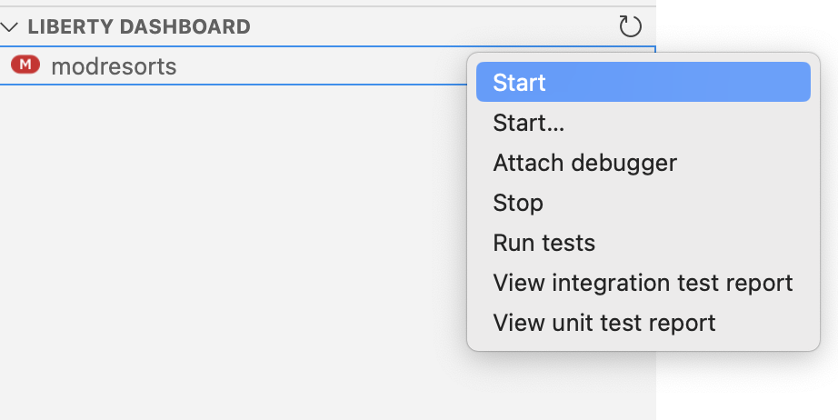

# Lab 1 - Code Explanation 

This document gives step-by-step guide to finish Lab1. Topics included: 

- Download recommended code assets.
- Explore the example `modresorts` application
- Explain `modresorts` application.


## Code Asset Download

Git clone [GitHub repository](https://github.com/bikashMainaliIBM/wca4ej-workshop ){target="_blank"} to your location of choice.

## Build Application Project

Open a terminal, and go to your project folder, and navigate to `was_dependency` folder.
```bash
cd <your-path>/wca4ej-workshop/modresorts-twas-j8/was_dependency
```

Once inside the folder, run the following command to build project:

```bash
mvn install:install-file -Dfile=was_public.jar -DpomFile=was_public-9.0.0.pom
```

if you get error with pom doesn't exist, you can goto cd <your-path>/wca4ej-workshop/modresorts-twas-j8 and 

```bash
mvn install:install-file -Dfile=./was_dependency/was_public.jar -DpomFile=./was_dependency/was_public-9.0.0.pom 
```


!!! Note "For Windows"
    For Windows users, you might need to give full path for the build files `was_public.jar` and `was_public-9.0.0.pom`.
    
    {width=75%}


## View Liberty App

After you installed LibertyTools from VSCode marketplace, there should be a Liberty Dashboard section in your explorer. Click `Add project to Liberty Dashboard` and put the path to the `modresort-twas-j8` folder (this would be automatic if you open in this project).


Once you have selected the correct project, a `modresrots` app will show up. Right click on the app to start.

{width=50%}

VSCode will go through downloading required packages, which you can see in terminal. 


Once the app started, you can get the url (example: `http://localhost:9080/resorts/`) and open in your browser to view the web app.

!!! Important 
    Because we are running this application using Liberty in Java21, while this application is built for WebSphere in Java8, even though the application started successfully, **there are 2 places that have error because of this migration + upgrade**.


The first one, if you click the `Where to?` dropdown and select any location, you will find the location information module showing errors.


The Second one, the `Logout` button does not work if you click on it.


We will **fix these errors** in the later labs.

## Explain Project Code

To understand the whole project, right click on the `modresorts-twas-j8` folder and select `watsonx Code Assistant` - `Explain Application`.

{width=75%}

VSCode will prompt you that the process takes extra time. Click `Proceed with code analysis`.

{width=25%}

The analysis might take 1-2 minutes to finish and a prompt will show up in the bottom right corner.

{width=75%}

Now we can open the report and read through the details.

{width=75%}