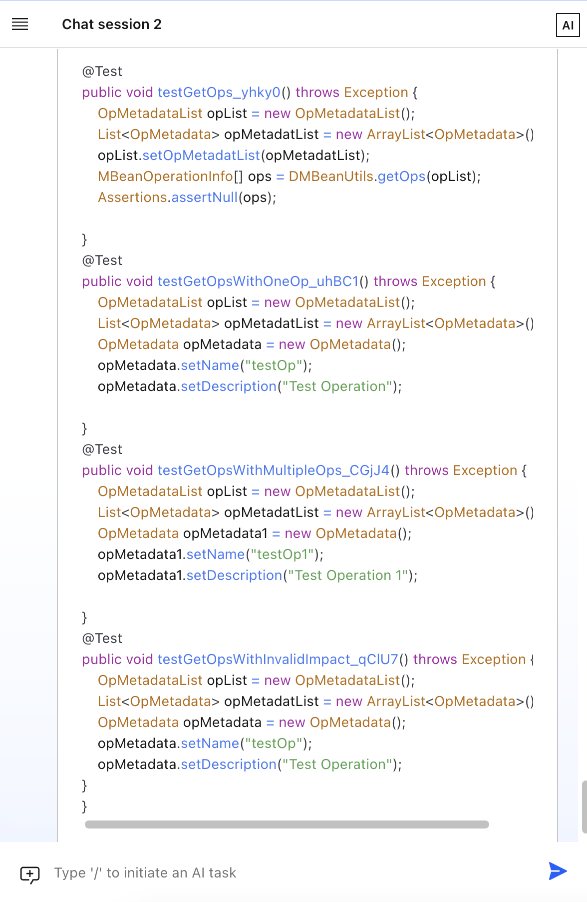

# Lab 4 - Unit Test Generation

This document gives step-by-step guide to finish Lab 4.  The lab covers the generation of unit test cases.

## Generate unit test for a given script

Right click on the any file, for example the ``

{width=75%}

The chat session will show again with the generated test cases.

Right click on the any file, for example the ``

{width=65%}
