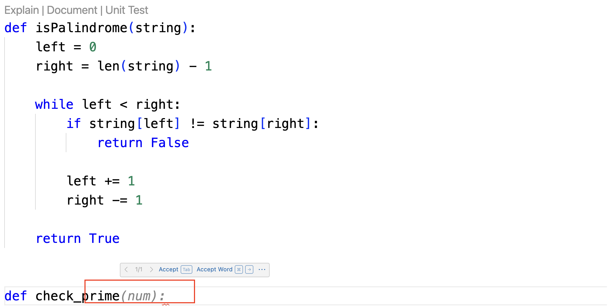

# Lab 5 - General Programming

This document gives step-by-step guide to finish Lab 5, but feel to add in a few of your own attempts.

The lab covers general programming with other languages, including
    - code auto completion
    - code explanation
    - code documentation
    - unit test generation
    - code translation

To get started, you can preview options for general programming capabilities in any inline functions.

{width=75%}

They align with options starting with backslash provided in the chat window.

{width=30%}


## Code Auto Completion

When developers write code, WCA will provide real-time inline suggestions.

{width=60%}

## Code Explanation

WCA can help explain the details and functions defined in the code sample.

This you can do by clicking the explain option on top of your functions.

Or, you can explain the entire file by typing the following in chat:

```
/explain @UseCase_Code_Palindrome.py
```

## Code Documentation

WCA can help generate documentation strings for a given code sample.

{width=35%}

## Unit test generation

Similar to what we see for Java, unit test generation is available for other languages.

{width=35%}

## Code Translation

Code translation is provided via the following syntex:

```
/translate from SOURCE_LANGUAGE to TARGET_LANGUAGE @REFERENCE_FILE|CODE_SNIPPET
```

Please note from SOURCE_LANGUAGE is an optional argument, and can be skipped while doing translation.

For this lab, we will convert the python palindrome code to Go language. Try the following prompt:

```
/translate from python to go UseCase_Code_Palindrome.py
```

{width=50%}
